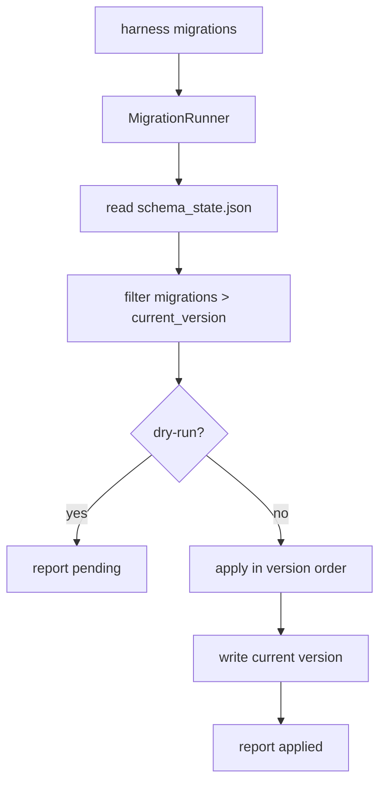

# 103-运维层-Migration-State Schema Migrations

## 中文版：本地状态也需要版本

### 全局作用

参见：[000-总览-Harness-分层架构与连载目录](000-总览-Harness-分层架构与连载目录.md)。本文位于 Observability / Evaluation / Ops 的 Migration 分支。

随着本地 Harness 增加 session、run、task、cache、secret、artifact、trace 等状态文件，状态格式迟早会变化。Migration 模块提供一个轻量版本化入口，让本地状态目录知道当前 schema version，并能按顺序应用 pending migrations。

### 输入 / 输出 / 行为

- 输入：state root、migration 列表、apply/status/dry-run。
- 输出：current version、pending migrations、applied migrations。
- 行为：
  - 默认 state 文件是 `schema_state.json`。
  - migration 按 version 升序应用。
  - 每个 migration 成功后写入当前 version。
  - dry-run 只报告 pending，不修改状态。
  - CLI 支持 status/apply/json。
- 失败模式：migration apply 抛错、state JSON 损坏、版本号倒退、并发写入锁竞争。

### 实现原理与流程图

`MigrationRunner` 将 state root 作为迁移边界，使用 lock 文件保护 `schema_state.json`。每个 migration 是一个带 version/name/apply callable 的对象。默认 migration 先创建 `schema/` 目录，作为后续 schema metadata 的位置。



### 当前实现

| 项 | 状态 |
|---|---|
| 层 | Observability / Evaluation / Ops |
| 模块 | Migration |
| 子模块 | State Schema Migrations |
| 实现状态 | 已实现最小可验证版本 |
| 对应提交 | 本轮实现 |

- `Migration`：version、name、apply。
- `MigrationRunner.status()`：查看当前状态。
- `MigrationRunner.apply_pending(...)`：应用 pending migrations。
- `MigrationReport.to_dict()`：CLI JSON 输出。
- CLI：`harness migrations --status/--apply/--dry-run --json`。

### 横向对标

| Harness | 对应实现 | 实现原理 |
|---|---|---|
| Claude Code | secure storage / session / config lifecycle | 产品级 harness 必须管理本地配置、session、memory、plugin cache 的版本演进。 |
| Codex | state DB、rollout trace、config migrations | Rust core 与桌面/app server 共享状态时，需要 migration 保障升级兼容。 |
| OpenClaw | gateway state、plugin cache、agent bindings | 多节点和 gateway 场景下，状态迁移影响 session routing 和插件协议。 |
| Hermes Agent | state.db、FTS5 session search、skills/memory lifecycle | 本地 DB 和技能/记忆系统需要 schema version 与压缩/迁移工具。 |

本仓库当前实现是文件级最小迁移器，不绑定具体数据库。与产品级 Harness 相比，还没有 migration rollback、checksum、backup、跨目录迁移、数据修复报告和版本兼容矩阵。

### 测试例跑法

```bash
PYTHONPATH=src python3 -m pytest tests/test_migrations.py -q
```

读者验证点：测试会验证 pending migration 只应用一次、dry-run 不改状态，以及 CLI status/apply JSON 输出。

### 后续扩展

- 为 session/task/run/cache 等具体状态增加真实迁移。
- apply 前自动生成 backup manifest。
- 增加 migration checksum 和失败恢复。
- 将 migration status 接入 doctor。

## English Version

State Schema Migrations provide a versioned local-state upgrade path. The
runner tracks `schema_state.json`, reports pending migrations, applies them in
order, and exposes a CLI. It is a small file-based migration layer for local
harness state, not a full database migration system yet.
