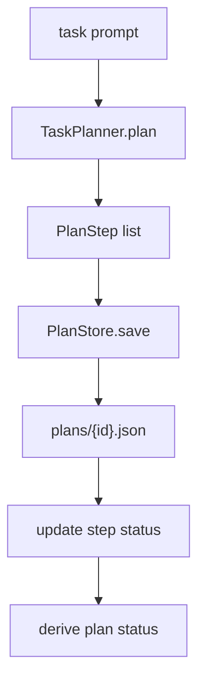

# 104-运行时层-Planner-Lightweight Task Plans

## 中文版：计划是辅助，不是强控

### 全局作用

参见：[000-总览-Harness-分层架构与连载目录](000-总览-Harness-分层架构与连载目录.md)。本文位于 Harness Runtime 的 Planner 分支，同时为后续 Workflow / State Machine 做准备。

Planner 解决的是长任务的显式分解和进度记录问题。这里不做 prompt-flow 式强控制，也不替模型规划每一步工具调用；它只把用户任务拆成可持久化 checklist，供人、Agent、run queue 和未来 workflow 共享状态。

### 输入 / 输出 / 行为

- 输入：自然语言任务描述。
- 输出：`Plan`，包含 plan id、title、steps、status。
- 行为：
  - `TaskPlanner` 将 prompt 拆成有序步骤。
  - `PlanStore` 将 plan 保存为 JSON。
  - 支持按 step index 更新状态。
  - 所有 step 完成时 plan 自动变成 completed。
  - CLI 支持 create/show/list/update。
- 失败模式：plan id 不存在、step index 不存在、状态非法、plan 文件损坏。

### 实现原理与流程图

轻量 Planner 当前用逗号、换行、分号和 `then` 做保守拆分。它的目的不是生成聪明计划，而是建立 plan 数据结构和持久化接口。之后可以把更强的模型规划器、subagent 拆分器或 workflow engine 接在同一层之上。



### 当前实现

| 项 | 状态 |
|---|---|
| 层 | Harness Runtime |
| 模块 | Planner |
| 子模块 | Lightweight Task Plans |
| 实现状态 | 已实现最小可验证版本 |
| 对应提交 | 本轮实现 |

- `TaskPlanner.plan(...)`：从 prompt 生成步骤。
- `PlanStore.save/load/list/update_step`：本地计划持久化。
- `HarnessConfig.plan_dir`：默认 `.harness/plans`。
- CLI：`harness plans --create/--show/--update --json`。

### 横向对标

| Harness | 对应实现 | 实现原理 |
|---|---|---|
| Claude Code | task registry、subagent handoff、todo/plan patterns | 计划服务于长程任务和上下文交接，但核心仍让模型自主调用工具。 |
| Codex | plan/update_plan、task state、rollout traces | 计划是工作可视化和进度同步接口，不是硬编码工作流。 |
| OpenClaw | cron、ACP control plane、session routing | 多通道任务需要显式任务状态和分发记录。 |
| Hermes Agent | kanban workers、delegate subagents | 计划和看板状态连接 durable worker 与子任务委托。 |

本仓库当前实现只做本地 checklist。与产品级 Harness 相比，还没有模型生成计划、计划和 run queue 自动联动、subagent 分配、失败补偿和人工审批节点。

### 测试例跑法

```bash
PYTHONPATH=src python3 -m pytest tests/test_planner.py tests/test_config.py -q
```

读者验证点：测试会验证 prompt 拆步、plan 持久化、step 状态更新、CLI create/update JSON 输出和 config/env 字段。

### 后续扩展

- 使用模型生成更好的计划，但保留人工可读 JSON。
- 将 plan step 绑定 run queue 和 task ledger。
- 支持 subagent 分配和结果 reducer。
- 演进到轻量 workflow/state machine。

## English Version

Lightweight Task Plans provide a persistent checklist for long-running local
harness work. They do not force a prompt-flow runtime; they expose plan state so
humans, agents, queues, and future workflow modules can coordinate.
